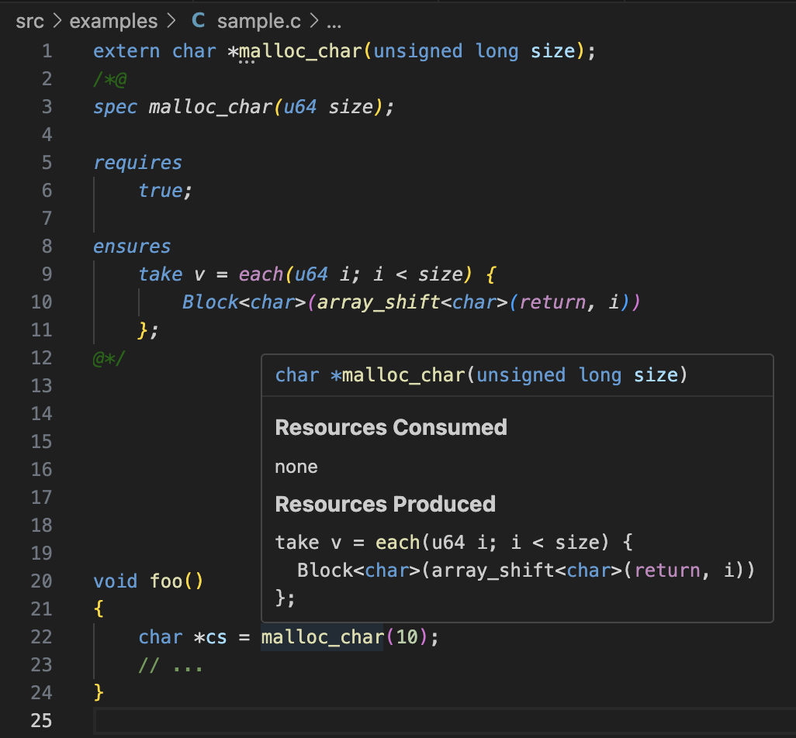

# Show Produced/Consumed Resources on Hover

Resources are one of CN's basic verification building blocks. CN reasons about
memory accesses by analyzing the production and consumption of "resources", a
concept amounting to permission to read or write to a memory handle. See [the
tutorial](https://rems-project.github.io/cn-tutorial/#_pointers_and_simple_ownership)
for more details.

CN can fail if it encounters a deficit of necessary resources - a pointer write
required a handle to permit that write, but there was no such handle in scope at
the time of the write, for instance. Whether a user forgot about the resource
entirely or tried to provide an improper resource, analyzing the failure often
amounts to determining what kind/shape of resource was required, what
kinds/shapes of resources were in scope, and where they were introduced. With
that information, a user then tries to determine why their view of the resource
environment doesn't match CN's.

An IDE can help this thought process along by letting users hover over code
elements to display the resources the element expects to produce and/or consume.
This is akin to showing types and/or docstrings on hover, a feature common to
many IDE language integrations.

## C Elements

As far as I can tell, the two main producers and consumers of resources are
functions and loops. If there are others, we should consider whether or not
they're good candidates for hover interactions as well.

### Function Identifiers

One code element that naturally supports this workflow is the function
identifier. When a user hovers over the name of a function, if that function has
a CN specification, we can show a tooltip that contains the resources that a
function expects to produce and/or consume.

Here's an example of how this could look:

(These tooltips support Markdown, so we should be able to style the information
to our liking. Of note, this image shows C syntax highlighting for the
resources, but it's
[possible](https://stackoverflow.com/questions/75903579/how-to-add-custom-language-syntax-highlighter-to-markdown-code-block-in-vscode)
that we could use CN syntax highlighting here instead.)

If I understand correctly, a function's CN specification is the only determinant
of the resources it expects to produce and/or consume. Put another way, that
information should not change regardless of the context in which the function is
called. This makes it easy to efficiently calculate or retrieve a function's
resource signature.

### Loops

Loops with invariants can also introduce and consume resources. Their signature
is specified as an inline invariant, after their keyword (e.g. `while`) and
before their braced body. The fact that their resource signature is necessarily
written down at their use site suggests to me that a loop tooltip would be
somewhat-to-substantially less valuable to a user than a function tooltip.

Consequently, I do not propose implementing hover support for loops.

## CN Elements

As far as I can tell, the best candidate for a hover interaction to show
resource evolution is an `extract` stanza. As with C elements, if there are
others, we should consider them.

### `extract`

An `extract` stanza is used to extract an individual element of an iterated
resource (as introduced by `each`), acting as a sort of hint that it might be
useful for subsequent resource consumers. This seems similar in spirit to
resource introduction, and a possible candidate for hover-based exploration.

However, unlike a function, an `extract` statement is not guaranteed to
successfully extract a resource, and its expected behavior can't be determined
statically in the same way a function's can. Implementation, then, would require
actually running CN verification on the relevant function, at which point I
think a different exploration mode would be more appropriate.
